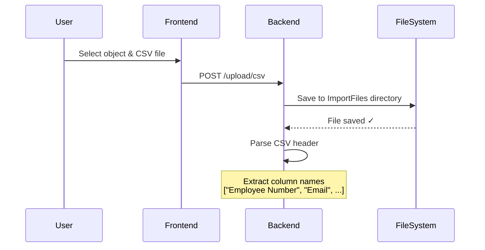
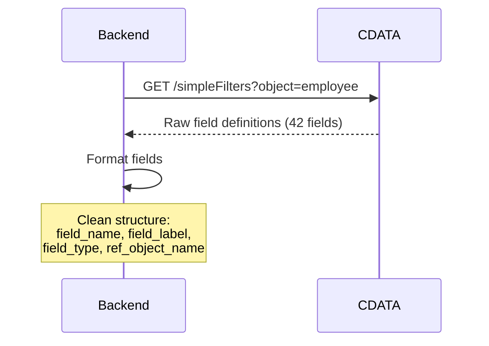
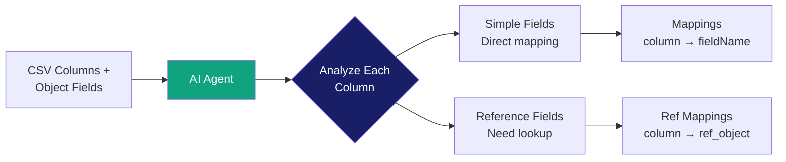
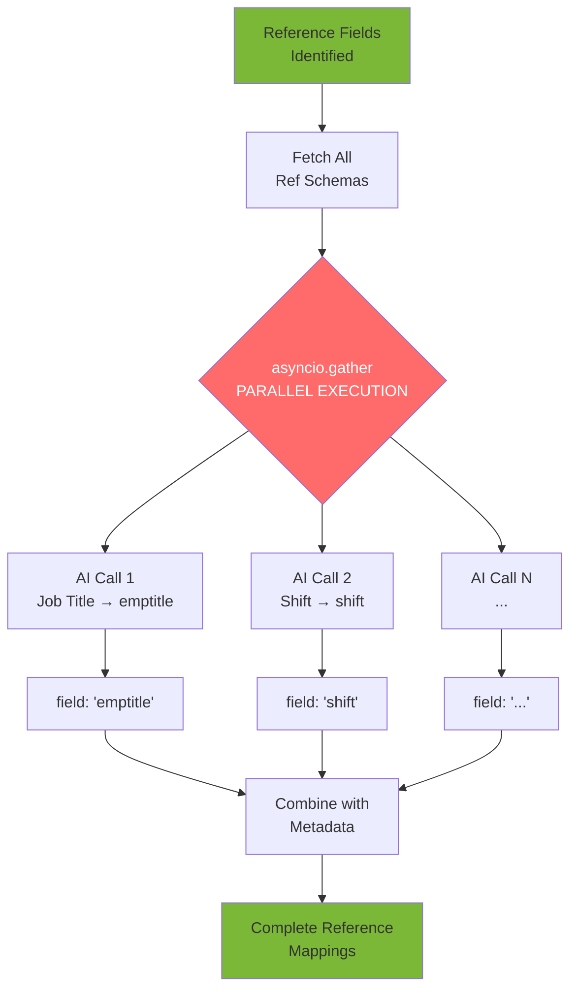
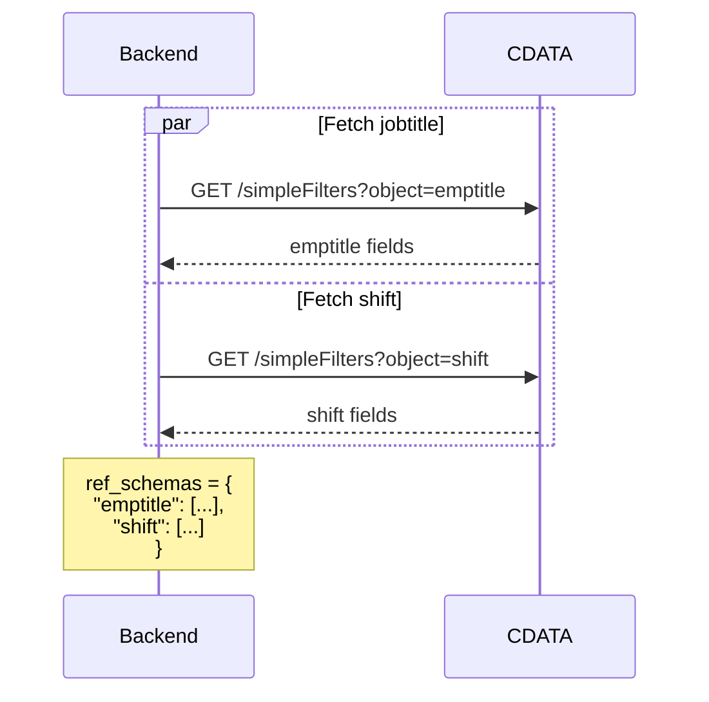
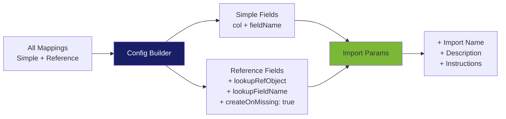

# AI Server - System Architecture & Workflow

> **A comprehensive guide to the AI-powered CSV import mapping system**

---

## 🔄 Complete Processing Workflow

### **Stage 1: File Upload & Preparation** 📁



**Details:**
- **File Location**: `{UPLOAD_DIRECTORY}/{filename}`
- **Example**: `C:\...\ImportFiles\employees.csv`
- **Validation**: CSV format, file size.
- **Result**: Object name is used to get schema. Column names extracted for mapping. File name is used to create import in the final step.

---

### **Stage 2: Schema Fetching** 🗄️



**Details:**
- **Endpoint**: `/rest/web/advancedFilter/simpleFilters`
- **Response**: Complete object schema with all fields
- **Processing**: Transform to AI-friendly format
- **Example Output**:
  ```json
    Example:
        Input (raw CDATA):
        [
            {
                "fieldName": "empno",
                "label": "Emp No",
                "fieldType": "string",
                "options": {
                    "title": "Employee Number",
                    "altVarName": "",
                    "fieldOrVar": "field",
                    "length": 26,
                    "required": true,
                }
            }
        ]
        
        Output (formatted):
        [
            {
                "field_name": "empno",
                "field_label": "Emp No",
                "field_type": "string",
                "whats_this": "Employee Number"
            }
        ]
  ```

---

### **Stage 3: AI Parent Object Mapping** 🤖



**AI Agent Configuration:**
```python
Agent(
    name="Field Mapping Agent",
    instructions="""Expert at CSV to database field mapping.
    Analyze column names and field definitions to find best matches.""",
    response_format=MappingObject  # Structured Pydantic output
)
```

**Example Mappings:**
| CSV Column | Field Name | Type | Notes |
|------------|------------|------|-------|
| Employee Number | `empno` | string | Direct mapping |
| Email | `email` | email | Direct mapping |
| Primary Job Title | `emptitle` | reference | → emptitle object |
| Department | `shift` | reference | → shift object |

---

### **Stage 4: Parallel Reference Processing** ⚡ 



#### **Step 4a: Fetch Reference Schemas**



#### **Step 4b: Build Parallel Prompts**

For **each** reference field:
1. Create individual prompt with column + ref object fields
2. Store metadata: `(column_name, ref_object, parent_field)`

**Example:**
- Prompt 1: Map "Primary Job Title" → jobtitle fields
- Prompt 2: Map "Department" → department fields

#### **Step 4c: Execute in Parallel** 

```python
# 🚀 THE MAGIC: All AI calls run simultaneously
results = await asyncio.gather(
    Runner.run(agent, prompt1),  # "Primary Job Title"
    Runner.run(agent, prompt2),  # "Shift"
    # ... N prompts, all parallel
)
```


#### **Step 4d: Combine Results**

```python
# Zip metadata with AI results
for (column, ref_obj, parent_field), result in zip(metadata, results):
    ref_obj_ai_mappings[column] = {
        "column": column,
        "parent_field_name": parent_field,
        "field_name": result.field_name,  # From AI
        "ref_object_name": ref_obj
    }
```

---

### **Stage 5: Import Configuration** ⚙️



**Field Override Structure:**

**Simple Field:**
```json
{
  "col": 0,
  "fieldName": "empno"
}
```

**Reference Field:**
```json
{
  "col": 4,
  "fieldName": "emptitle",
  "lookupRefObject": "jobtitle",
  "lookupFieldName": "title",
  "createOnMissing": true  // ✓ Always true for references
}
```

---

### **Stage 6: CDATA Import Creation** 🎯

#### Payload Example: 
```json
{
  "params": {
    "fieldOverrides": [
      {
        "col": 0,
        "fieldName": "equipno"
      },
      {
        "col": 1,
        "fieldName": "assettype",
        "lookupRefObject": "assettype",
        "lookupFieldName": "descr",
        "createOnMissing": true
      },
      {
        "col": 2,
        "fieldName": "make",
        "lookupRefObject": "eqmake",
        "lookupFieldName": "make",
        "createOnMissing": true
      },
      {
        "col": 4,
        "fieldName": "model",
        "lookupRefObject": "eqmodel",
        "lookupFieldName": "model",
        "createOnMissing": true
      },
      {
        "col": 5,
        "fieldName": "equipstatus",
        "lookupRefObject": "equipstatus",
        "lookupFieldName": "equipstatus",
        "createOnMissing": true
      },
      {
        "col": 6,
        "fieldName": "purdate"
      }
    ],
    "importName": "Asset AI Atlas",
    "importDescription": "Asset info from AI",
    "importInstructions": "Load data from equip_ai.csv."
  }
}
```

**Details:**
- **Endpoint**: `/rest/web/import/saveImport/builder:{object}/{file}`
- **Auth**: Basic authentication (username, password)
- **Lookup Field**: First fieldOverride's fieldName
- **Graceful Failure**: Returns error but continues processing

---

